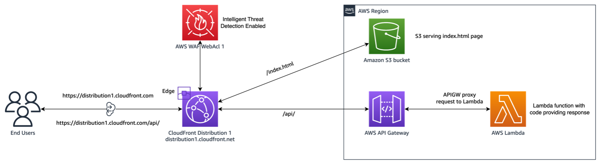
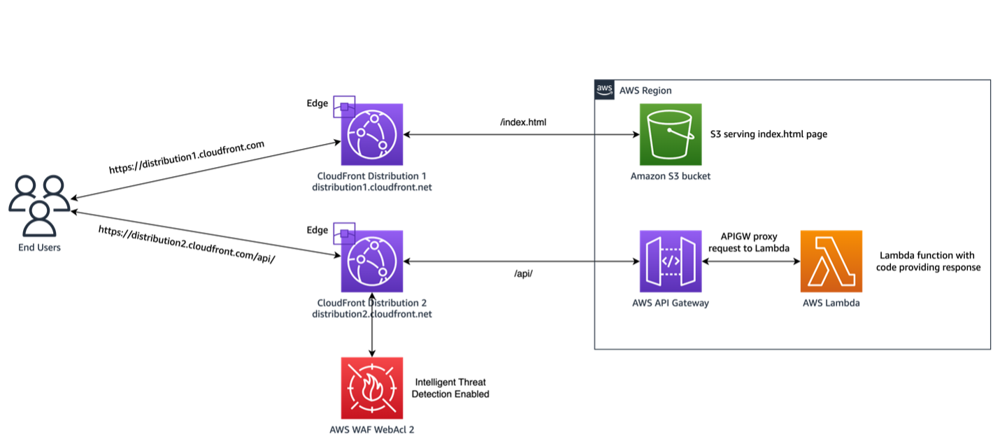

# Using AWS WAF intelligent threat mitigations with cross-origin API access

AWS WAF offers advanced features for filtering undesired web application traffic, such as Bot Control and Fraud Control. These intelligent threat mitigations include techniques such as client-side interrogations using javascript challenges or CAPTCHA, and client-side behavioral analysis. 

Implementing these techniques on a web page with a same-origin access is straight forward. When a cross-domain access is needed, for example when APIs are exposed on a different domain that the webpage itself, configuring AWS WAF’s intelligent threat mitigations require additional steps. With this solution you will learn about these additional steps, using a Single Page Application (SPA) example. The SPA  displays the country and IP information of the viewer using an API.

When the solution is deployed, first test the legitimate user workflow by clicking on the button. To test the CAPTCHA workflow, change the user agent of your browser to a random value which will be picked as suspicious signal by the Bot Control.

You can read the [full blog here](https://aws.amazon.com/blogs/networking-and-content-delivery/using-aws-waf-intelligent-threat-mitigations-with-cross-origin-api-access/).

## Scenario 1: SPA example with same-origin access



Deploy the solution in us-east-1, by following the next steps in your CLI:

```
git clone https://github.com/aws-samples/aws-waf-bot-control-api-protection-with-captcha.git
cd aws-waf-bot-control-api-protection-with-captcha-main
npm install
npm run build
cdk bootstrap
cdk deploy 
```

## Scenario 2: SPA example with cross-origin access



Update the deployed infrastructure using this command line:

```
cdk deploy -c CROSS_DOMAIN_ENABLED=true
```

## Security

See [CONTRIBUTING](CONTRIBUTING.md#security-issue-notifications) for more information.

## License

This library is licensed under the MIT-0 License. See the LICENSE file.
